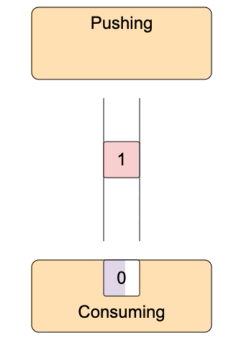

# Producer-Consumer problem visualization

See working example <a href="https://micromind.me/node-writable-streams/visual/index.html?msrc=gh-producer-consumer-vis">here</a>. Read article about it <a href="https://micromind.me/posts/nodejs-writable-streams-distilled?msrc=gh-producer-consumer-vis">here</a>.

